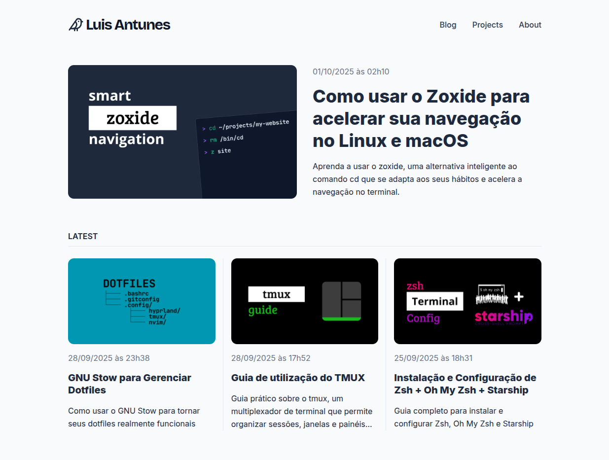

<div align="center">
  <a href="https://antunesluis.com.br">
    <picture>
      <source media="(prefers-color-scheme: dark)" srcset="public/images/home.png">
      
    </picture>
  </a>
  <h1 align="center">
    antunesluis.com.br
  </h1>

  <p align="center">
    
    
    
    
    
    
  </p>
</div>

<br />

A modern personal blog built with Next.js that renders Markdown posts with a
complete administrative area for content management.

## Features

### Public Frontend

- **Blog Posts**: Full Markdown rendering with syntax highlighting and GitHub
  Flavored Markdown
- **Featured Posts**: Automatic highlighting of featured articles on homepage
- **Project Portfolio**: Showcase of software projects with technical details
- **About Page**: Personal information with resume download and social links
- **Responsive Design**: Mobile-first approach with modern, clean interface

### Administrative Area

- **Login System**: Secure authentication with password hashing
- **Post Management**: Complete CRUD operations (create, read, update, delete)
- **Markdown Editor**: Intuitive interface for creating and editing posts
- **Image Upload**: Integrated upload system for cover images
- **Publication Status**: Control over published/draft posts
- **Route Protection**: Authentication middleware for all admin routes

### SEO & Performance

- **Advanced SEO**: Complete Schema.org structured data (JSON-LD) implementation
- **Dynamic Meta Tags**: Automatic Open Graph and Twitter Card generation
- **Sitemap & Robots.txt**: Automated XML sitemap generation

## Tech Stack

### Core Technologies

- **Next.js 15.3.3** - React framework with App Router
- **React 19** - User interface library
- **TypeScript 5** - Typed programming language

### Database

- **SQLite** - Lightweight, serverless database
- **Drizzle ORM 0.44.4** - Type-safe SQL query builder
- **Better SQLite3** - Synchronous SQLite driver for Node.js
- **Drizzle Kit** - Database migrations and introspection

### Markdown & Editor

- **@uiw/react-md-editor** - React Markdown editor
- **react-markdown** - Markdown renderer
- **remark-gfm** - GitHub Flavored Markdown support
- **rehype-sanitize** - HTML sanitization
- **sanitize-html** - HTML cleaning

### Authentication & Security

- **bcryptjs** - Password hashing
- **jose** - JWT manipulation
- **Zod** - TypeScript schema validation
- **Proxy** - Next.js proxy for route protection

## Security

- **Authentication**: bcrypt password hashing
- **Middleware**: Automatic protection of administrative routes
- **Validation**: Zod schemas for input validation
- **Sanitization**: Safe Markdown and HTML processing

## Getting Started

### Prerequisites

- Node.js 18+
- npm or yarn

### Installation

1. **Clone the repository**

```bash
   git clone https://github.com/antunesluis/antunesluis.com.br.git
   cd antunesluis.com.br
```

2. **Install dependencies**

```bash
   npm install
```

3. **Set up environment variables**

```bash
   cp .env.example .env.local
```

Edit `.env.local`:

```env
   NEXT_PUBLIC_SITE_URL=http://localhost:3000
   ADMIN_PASSWORD_HASH=your_hash_here
   JWT_SECRET=your_secret_here
   ...
```

5. **Run the database migrations**

```bash
   npm run migrate
```

6. **Start development server**

```bash
   npm run dev
```

Open [http://localhost:3000](http://localhost:3000) 🎉

## License

This project is licensed under the MIT License. See the [LICENSE](LICENSE) file
for more details.
