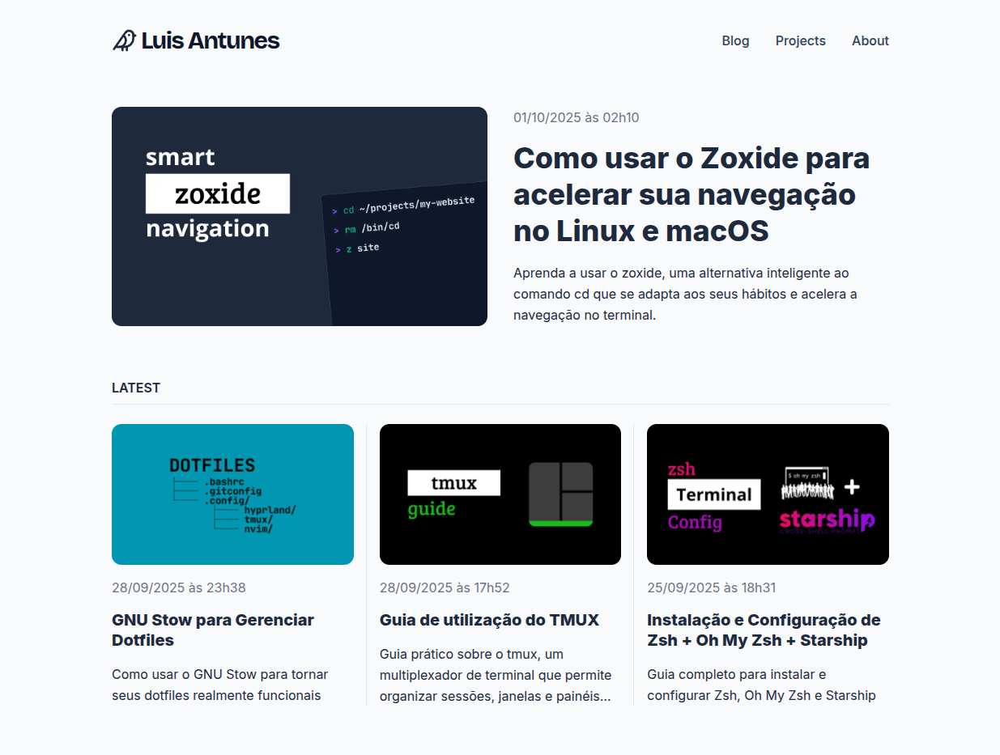

<div align="center">
  <a href="https://antunesluis.com.br">
    <picture>
      <source media="(prefers-color-scheme: dark)" srcset="public/images/home.png">
      
    </picture>
  </a>

  <h1>antunesluis.com.br</h1>

  <p>Personal blog and portfolio built with Next.js.</p>
</div>

## Features

### Public area

- Markdown blog posts with syntax highlighting and GitHub Flavored Markdown
- Project portfolio with descriptions and technology tags
- About page with resume and social links
- Responsive light and dark themes
- Comments powered by Giscus
- Metadata, JSON-LD, sitemap, and robots.txt

### Administrative area

- Authentication with bcrypt, JWT, and protected routes
- Post and project CRUD with draft and published states
- Markdown editor with preview
- Cover image upload

## Tech stack

- Next.js 16.0.10 with App Router and Turbopack
- React 19.2
- TypeScript 5
- Tailwind CSS 4
- Drizzle ORM 0.44 with SQLite and better-sqlite3
- Zod 4, React Markdown, and Giscus

## Getting started

### Requirements

- Node.js 20.9.0 or newer
- npm

The repository includes an `.nvmrc` pinned to Node.js 24.19.0 LTS. With nvm:

```bash
nvm install
nvm use
```

### Setup

```bash
git clone https://github.com/antunesluis/antunesluis.com.br.git
cd antunesluis.com.br
npm ci
cp .env.local-example .env.local
npm run migrate
npm run dev
```

The development server runs at <http://localhost:3000>.

To create the base64-encoded bcrypt hash used by `LOGIN_PASS`:

```bash
node -e "const bcrypt = require('bcryptjs'); const hash = bcrypt.hashSync('your-password', 10); console.log(Buffer.from(hash).toString('base64'));"
```

## Environment variables

Use `.env.local-example` as the reference and configure these variables in
`.env.local`:

| Variable                            | Purpose                                      |
| ----------------------------------- | -------------------------------------------- |
| `NEXT_PUBLIC_GISCUS_REPO`           | Giscus repository in `owner/repository` form |
| `NEXT_PUBLIC_GISCUS_REPO_ID`        | Giscus repository ID                         |
| `NEXT_PUBLIC_GISCUS_CATEGORY`       | Giscus discussion category                   |
| `NEXT_PUBLIC_GISCUS_CATEGORY_ID`    | Giscus category ID                           |
| `NEXT_PUBLIC_IMAGE_UPLOAD_MAX_SIZE` | Maximum upload size in bytes                 |
| `IMAGE_UPLOAD_DIRECTORY`            | Local directory used to store uploads        |
| `IMAGE_SERVER_URL`                  | Public base URL for uploaded images          |
| `JWT_SECRET_KEY`                    | Secret used to sign login tokens             |
| `NEXT_PUBLIC_SITE_URL`              | Canonical public URL of the site             |
| `LOGIN_EXPIRATION_SECONDS`          | Login lifetime in seconds                    |
| `LOGIN_EXPIRATION_STRING`           | Login lifetime accepted by `jose`            |
| `LOGIN_COOKIE_NAME`                 | Authentication cookie name                   |
| `LOGIN_USER`                        | Administrative username                      |
| `LOGIN_PASS`                        | Base64-encoded bcrypt password hash          |
| `ALLOW_LOGIN`                       | Enables login when set to `1`                |

## Commands

| Command           | Purpose                       |
| ----------------- | ----------------------------- |
| `npm run dev`     | Start the development server  |
| `npm run lint`    | Run ESLint for the repository |
| `npm run build`   | Create a production build     |
| `npm run start`   | Start the production server   |
| `npm run migrate` | Apply Drizzle migrations      |
| `npm run seed`    | Seed the local SQLite database |
