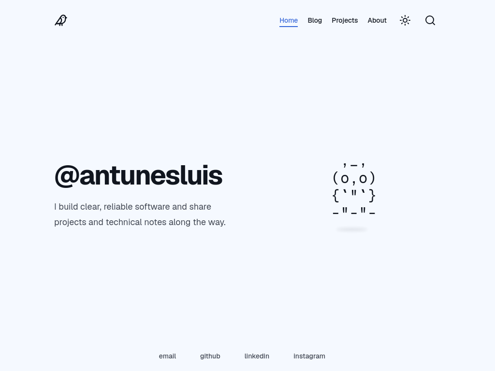

<div align="center">
  <a href="https://antunesluis.com.br">
    <picture>
      <source media="(prefers-color-scheme: dark)" srcset="public/images/home.png">
      
    </picture>
  </a>

  <h1>antunesluis.com.br</h1>

  <p>Meu espaço pessoal para compartilhar projetos, artigos e ideias sobre tecnologia.</p>
</div>

## Sobre

Este repositório reúne o código do meu site pessoal. Ele nasceu como um lugar
para organizar o que venho aprendendo, apresentar projetos e publicar textos
sobre desenvolvimento de software.

Além das páginas abertas ao público, o site possui uma área administrativa para
criar e editar conteúdos de forma simples.

## O que você encontra por aqui

- Artigos escritos em Markdown
- Projetos com descrições e tecnologias utilizadas
- Uma página sobre minha trajetória
- Temas claro e escuro
- Comentários nos artigos
- Uma área privada para administrar o conteúdo

## Tecnologias

O projeto é construído com Next.js, React, TypeScript e Tailwind CSS. Os dados
são armazenados em SQLite e acessados com Drizzle ORM.

## Rodando localmente

Com Node.js 22.13 ou mais recente e npm instalados, clone o repositório e rode:

```bash
npm ci
cp .env.local-example .env.local
```

Revise o arquivo `.env.local` e substitua os valores indicados como
obrigatórios. O próprio arquivo de exemplo explica como preencher cada um. Em
seguida:

```bash
npm run migrate
npm run dev
```

Depois, acesse <http://localhost:3000>.

## Comandos úteis

- `npm run dev` inicia o ambiente de desenvolvimento
- `npm test` executa os testes
- `npm run lint` verifica o código
- `npm run build` gera a versão de produção
- `npm run migrate` aplica as migrações do banco de dados
- `npm run seed` adiciona os dados iniciais
